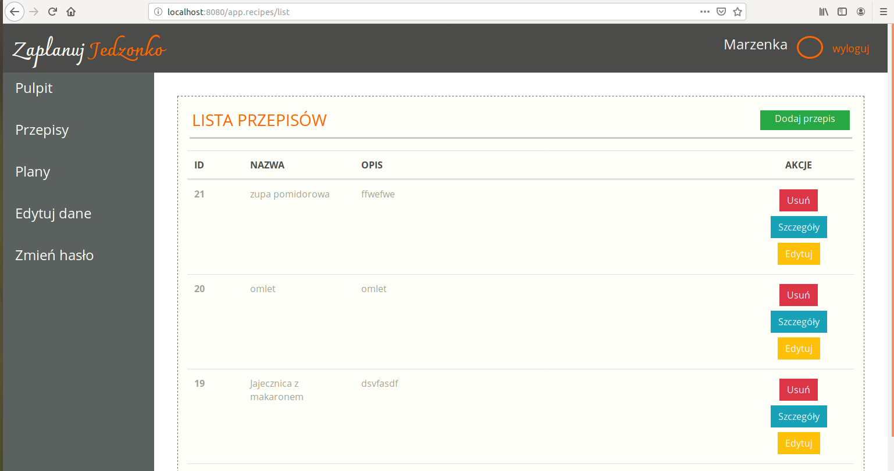
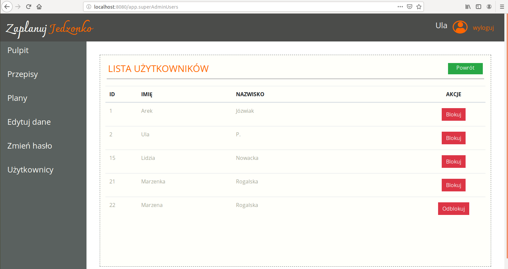

## "Zaplanuj jedzonko" (plan your meals)

This is an application for meal planning where you can register and add 
(also edit or delete) recipes. Than you can add them to any of your nutrition plan. 
You can add a new nutrition plan as well.
Each can have a different meal planned for every day of the week.
There is also a special panel for super admin, where they can enable or disable any user.

This was a group project using Scrum methodology, part of the Java Developer Web course in CodersLab IT school.

Technologies:
- Java
- Servlets
- MySQL
- JSP
- Maven

You can try how it works here: http://ulapla.mooo.com:8082/

login: gosc@g.pl 

hasło: goscgosc

or create your own account.

