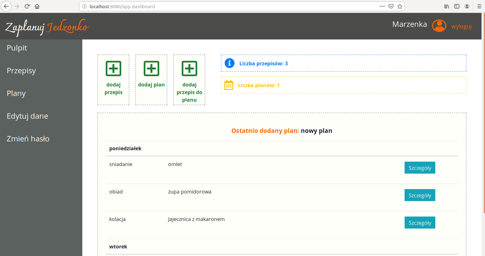
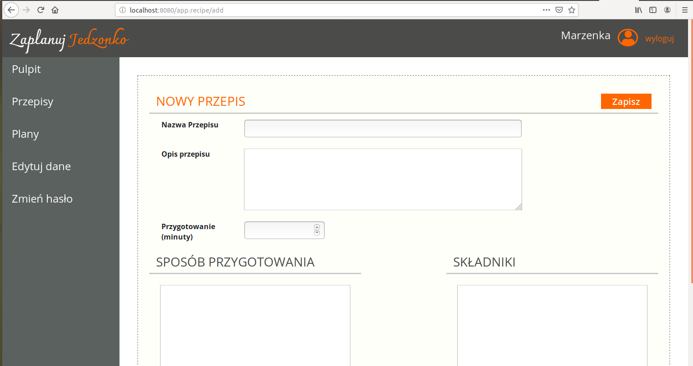
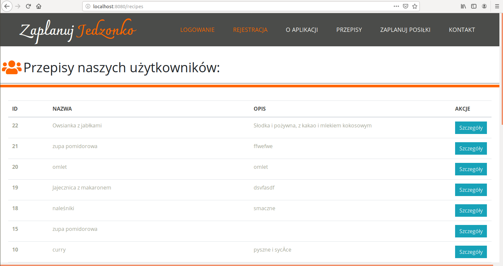

## "Zaplanuj jedzonko" (plan your meals)

This is an application for meal planning where you can register and add 
(also edit or delete) recipes, add them to your nutrition plan. 
You can also have many of them. 
Each can have a different meal planned for every day of the week.
There is also a special panel for super admin, where they can enable or disable any user.

This was a group project using Scrum methodology, part of the Java Developer Web course in CodersLab IT school.

Technologies:
- Java
- Servlets
- MySQL
- JSP
- Maven

